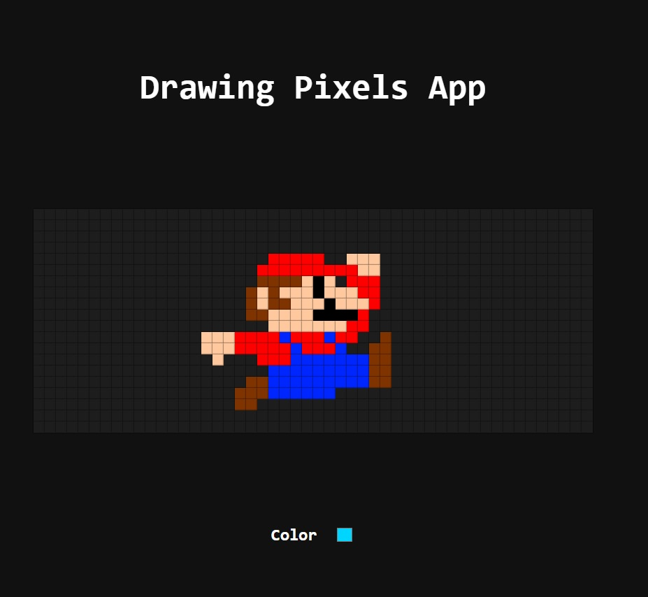

  <h1 align="center">Drawing Pixels App</h1>

  

    
  

  <h2>Description</h2>

  

    The Drawing Pixels App is a web application built to explore pixel art creation using React.js. This project was developed as part of my journey in learning front-end development, focusing on interactive user interfaces and TypeScript integration.
  

  

  <h2>Steps to Run the Project</h2>

  <ol>
    <li><strong>Clone the repository:</strong> 
      <code>git clone https://github.com/your-username/your-repository.git cd your-repository</code></li>
    <li><strong>Install dependencies:</strong> 
      <code>npm install</code></li>
    <li><strong>Run the development server:</strong> 
      <code>npm run dev</code> 
      This will start the Vite development server. Open <a href="http://localhost:3000">http://localhost:3000</a> to view it in the browser.</li>
  </ol>

  

  <h2>Technologies Used</h2>

  <ul>
    <li><strong>Vite:</strong> Front-end build tool that serves React fast.</li>
    <li><strong>React:</strong> JavaScript library for building user interfaces.</li>
    <li><strong>TypeScript:</strong> Typed superset of JavaScript that compiles to plain JavaScript.</li>
  </ul>
